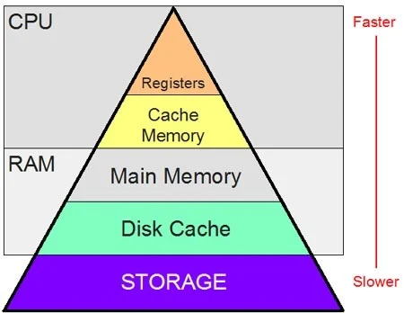

## What is a Cache?
A cache is a temporary storage component that stores data so future requests for that data can be served faster. The primary purpose of a cache is to increase data retrieval performance by reducing the need to access the slower underlying storage layer.


## How Caching Works

Request Process: When data is requested, the system first checks if it exists in the cache
- Cache Hit: If the data is found in cache, it's returned quickly (a "hit")
- Cache Miss: If not found, the system retrieves it from the primary storage (a "miss")
- Storage: After a miss, the retrieved data is usually stored in the cache for future requests

## Why Caching is Important
Caching improves performance through several mechanisms:

- Reduced latency: Accessing cache is faster than primary storage
- Decreased load: Primary systems (databases, APIs) handle fewer requests
- Bandwidth savings: Less data needs to be transferred
- Improved responsiveness: Applications feel faster to users


## LRUCACHE
An LRU (Least Recently Used) Cache is a data structure that maintains a fixed-size collection of key-value pairs. When the cache reaches its capacity and a new item needs to be added, it automatically discards the least recently used item.


## How it works

- The cache maintains items in order of usage recency
- When you access an item, it becomes the "most recently used"
- When you add a new item to a full cache, the "least recently used" item is evicted

## Implementation details
LRU Cache typically combines:

- A hash map (dictionary) for O(1) lookups by key
- A doubly linked list to maintain usage order efficiently


## Code
```
import java.util.*;

public class LRUCache {
    private int capacity;
    private int size;
    private Node head, tail;
    private Map<String, Node> map;

    LRUCache(int capacity) {
        this.capacity = capacity;
        this.size = 0;
        this.head = null;
        this.tail = null;
        this.map = new HashMap<>();
    }

    public String get(String data) {
        if (!map.containsKey(data)) {
            throw new RuntimeException("Data not found: " + data);
        }
        Node node = map.get(data);
        if (node != head) {
            remove(node);
            addAtHead(node);
        }
        return node.data;
    }

    public void put(String data) {
        if (map.containsKey(data)) {
            Node node = map.get(data);
            remove(node);
            addAtHead(node);
        } else {
            Node node = new Node(data);
            if (size == capacity) {
                map.remove(tail.data);
                remove(tail);
            }
            addAtHead(node);
        }
    }

    private void addAtHead(Node node) {
        node.prev = null;
        node.next = head;
        if (head != null) {
            head.prev = node;
        }
        head = node;
        if (tail == null) {
            tail = node;
        }
        map.put(node.data, node);
        size++;
    }

    private void remove(Node node) {
        if (node.prev != null) {
            node.prev.next = node.next;
        } else {
            head = node.next;
        }
        if (node.next != null) {
            node.next.prev = node.prev;
        } else {
            tail = node.prev;
        }
        size--;
    }

    public void print() {
        Node node = head;
        while (node != null) {
            System.out.print(node.data);
            if (node.next != null) {
                System.out.print(" -> ");
            }
            node = node.next;
        }
        System.out.println();
    }
}

```

## Real-life use cases

- Web browsers - Store recently visited pages for faster access when you click "back"
- Database query caches - Keep results of expensive queries in memory to avoid repeating them
- Content Delivery Networks (CDNs) - Cache frequently accessed content closer to users
- Operating systems - Manage memory pages, keeping frequently accessed ones in RAM
- Mobile applications - Store data locally to reduce server requests and function offline
- Image processing software - Keep recently used images in memory to avoid disk reads

- The key benefit of LRU Cache is balancing memory efficiency with performance by keeping only the most relevant data readily available, which matches many real-world usage patterns where recently accessed items are more likely to be accessed again.